# 系统模块介绍
1. cloud_user：用户认证模块，可以单体使用，也可以在微服务使用，使用的是jwt实现的
2. cloud_gateway：网关模块，统一校验权限
3. cloud_api_commons：公共模块，存放一些公共的类
4. cloud_price_provider：抽奖模块提供者
5. cloud_price_consumer：抽奖模块消费者，主要是为了使用openfeign
6. SQL文件项目已经给出：ah2025.sql，需要自己去配置数据库的连接信息
7. 另外还需要自己配置nacos注册中心的连接信息

### 1.首页
在首页可以查看到活动信息，然后右上角有登录/注册链接
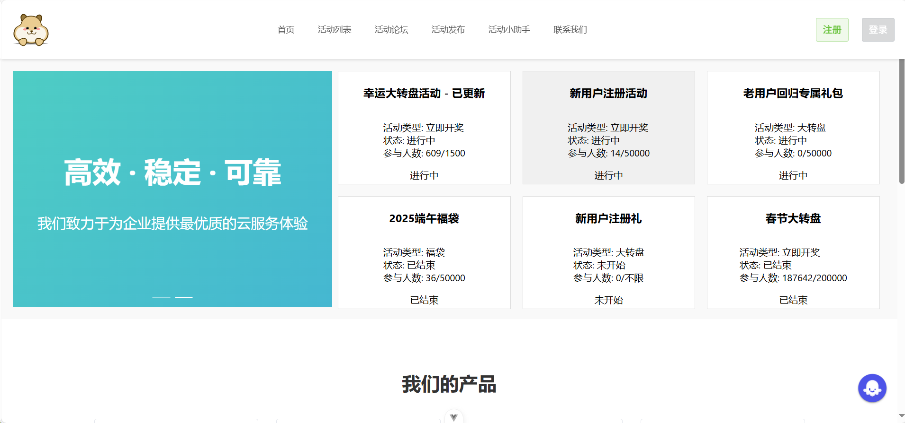

#### 1.1注册功能
首先我们注册一下，如果该邮箱已经被注册了，则无法注册
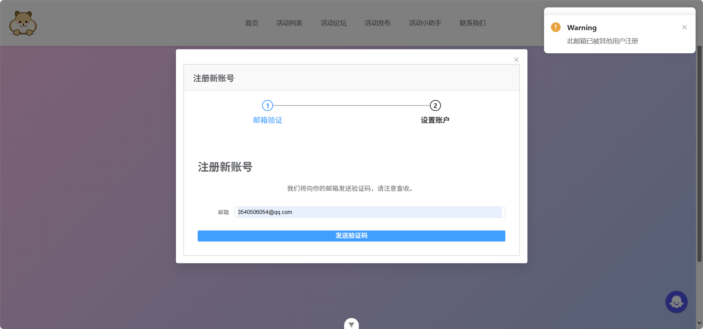

如果该邮箱没有被注册，则会正常发送邮件
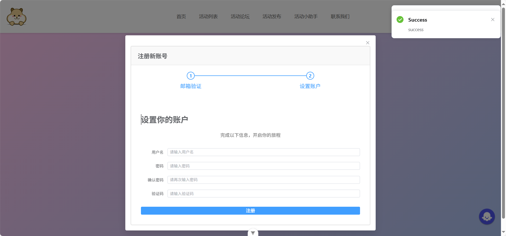

然后我们将邮件中的验证码和个人信息填写好后注册
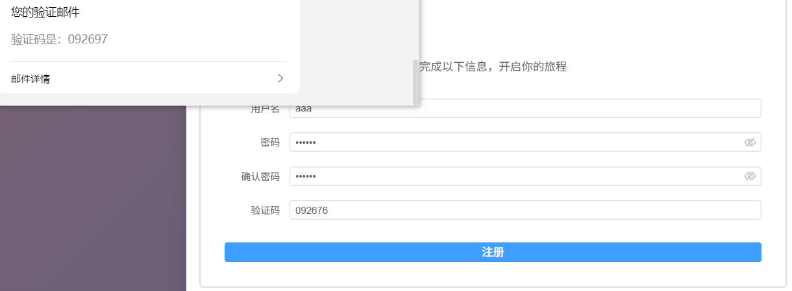

如果验证码不一致,则不允许注册
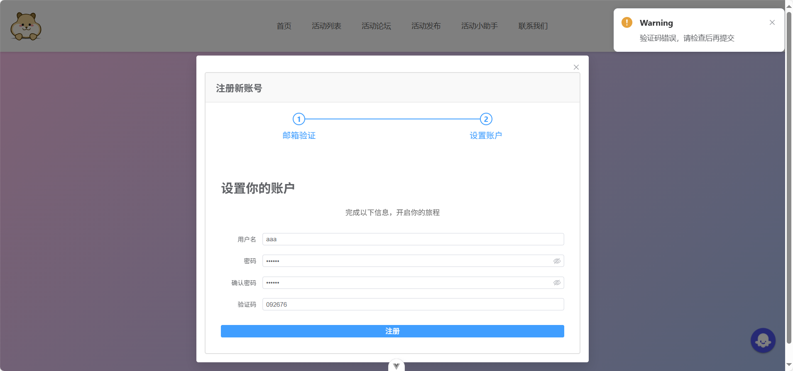

#### 1.2登录功能
登录后可以查看自己的个人信息
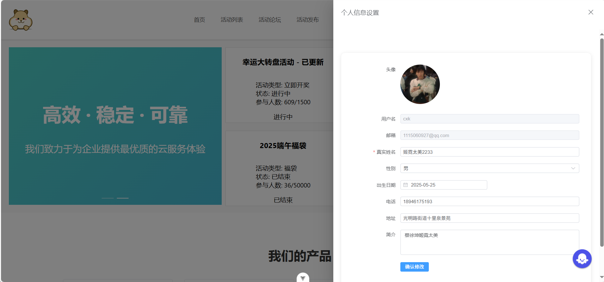

### 2.活动相关

#### 2.1活动列表
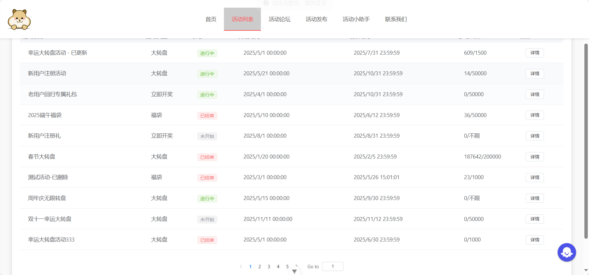

#### 2.2活动详情
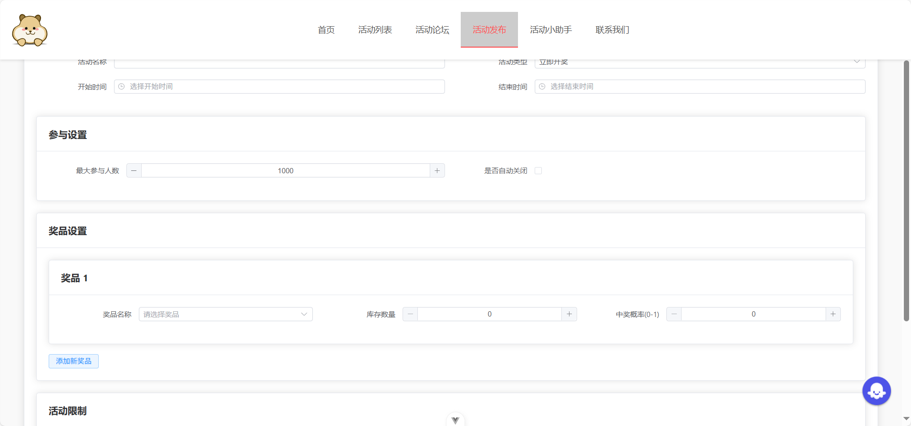

#### 2.3抽奖页面
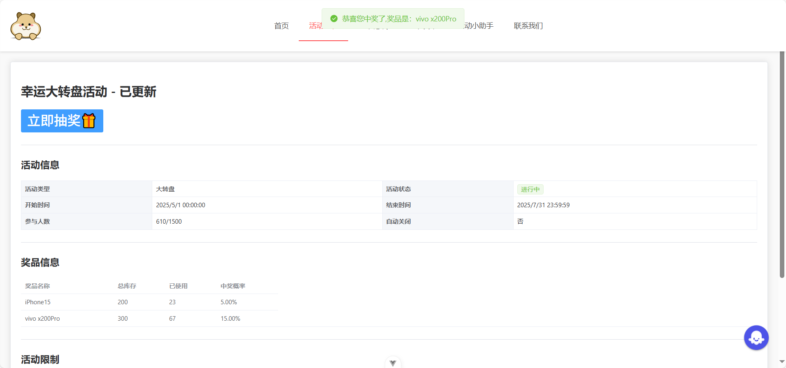

### 3.用户信息
所有信息均可以导出成excel表
#### 3.1参与列表
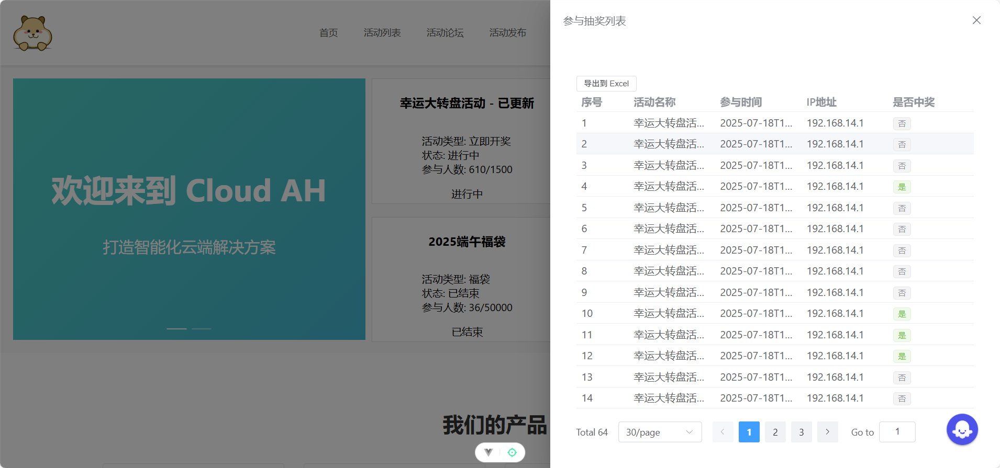
#### 3.2中奖列表
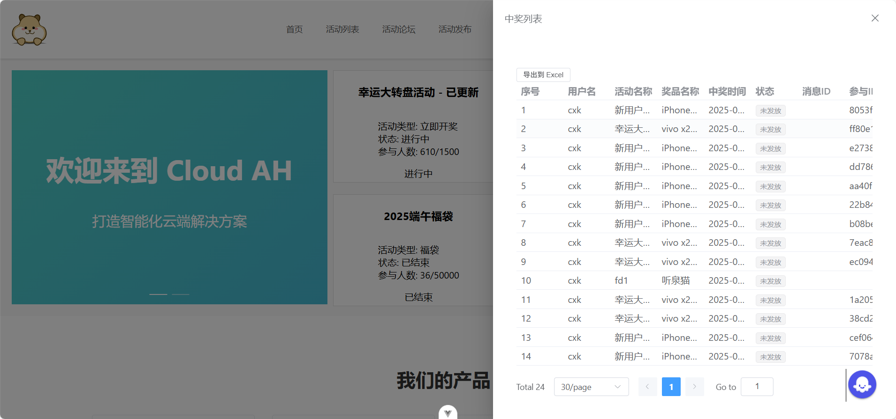

### 4.其他
#### 4.1联系我们
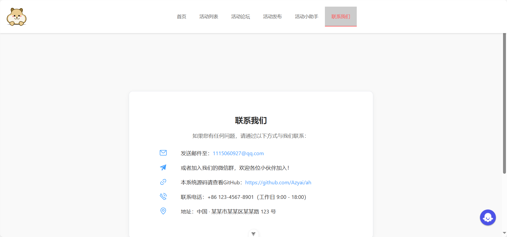